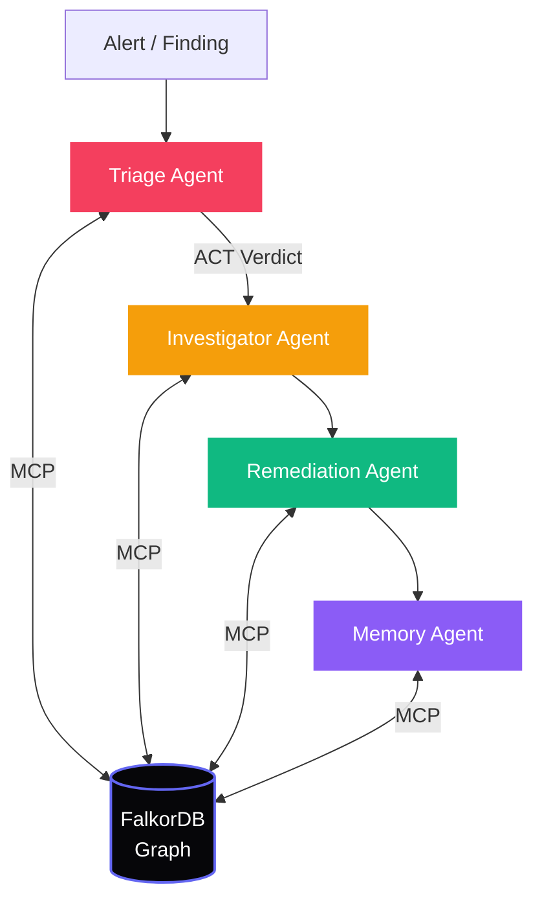

<div align="center">

# 🌌 SentinelGraph
**The Graph-Powered Autonomous Security Brain**

[](https://falkordb.com/)
[](https://vitejs.dev/)
[](https://fastapi.tiangolo.com/)
[](https://opensource.org/licenses/MIT)

*SentinelGraph utilizes the connected context of a graph database to power a suite of intelligent agents that triage alerts, coordinate incident responses, and explain their reasoning using multi-hop graph paths.*

</div>

<br />

## 🌟 Why SentinelGraph?

Traditional security tools evaluate vulnerabilities in isolation. **SentinelGraph** contextualizes them. By mapping your entire infrastructure, past decisions, and historical resolutions into a unified graph, it empowers AI agents to reason about security just like an expert human analyst—only faster.

- **Multi-Hop Reasoning:** Look beyond the immediate alert to trace attack paths across complex infrastructures.
- **Blast Radius Calculation:** Utilize centrality scoring and pathfinding to determine exactly which critical assets are exposed.
- **Connected Context for Generative AI:** Ground LLM hallucinations by forcing agents to provide proven Cypher graph paths as evidence.

---

## 🏗️ Architecture

SentinelGraph employs a multi-agent system connected via the Model Context Protocol (MCP) directly to **FalkorDB**. 



### 🤖 The Agent Swarm
* **🚨 Triage Agent:** Evaluates raw findings against the graph to determine actual risk.
* **🕵️ Investigator Agent:** Traces paths to discover who owns the vulnerable service and *why* it was configured that way.
* **🛡️ Remediation Agent:** Drafts actionable playbooks and assigns tickets to the correct team.
* **🧠 Memory Agent:** Updates the company brain with the resolution to inform future triage.

---

## 🚀 Quickstart

You can launch the entire stack using Docker, or run the components locally for development.

### Option A: Docker (Recommended)
```bash
# 1. Copy the environment variables
cp .env.example .env

# 2. Boot the stack (FalkorDB, API, MCP Server, Web)
docker-compose up -d --build
```
> **🌐 Web App:** [http://localhost:5173](http://localhost:5173) | **🔌 API:** [http://localhost:8000](http://localhost:8000)

### Option B: Local Development (Without Docker)
*Note: This relies on an offline mock if FalkorDB is not reachable natively.*
```bash
# Terminal 1: Backend
python -m pip install -r requirements.txt
python -m uvicorn api.main:app --port 8000

# Terminal 2: Frontend
cd web
npm install
npm run dev
```

---

## 📊 Graph Data Model

SentinelGraph partitions its intelligence into three interconnected subgraphs:

| Subgraph | Nodes | Edges | Purpose |
| :--- | :--- | :--- | :--- |
| **🌐 Infrastructure (T1)** | `(:Asset)`, `(:Service)`, `(:Identity)`, `(:Finding)` | `[:CONNECTS_TO]`, `[:HAS_ACCESS]`, `[:AFFECTS]` | Topology for attack path mapping and calculating blast radius. |
| **🕰️ Memory (T2)** | `(:Fact)`, `(:Playbook)`, `(:Incident)` | `[:SUPERSEDES]`, `[:RESOLVED_WITH]` | Bi-temporal storage of resolutions and evolving context updates. |
| **🏢 Company Brain (T3)** | `(:Team)`, `(:Person)`, `(:Decision)`, `(:Document)` | `[:OWNS]`, `[:AUTHORED]`, `[:DECIDED_IN]` | Mapping historical architecture decisions to developers for intelligent routing. |

---

## 🔍 Core Cypher Queries

These foundational Cypher queries represent the multi-hop logic powering our AI agents:

### 1. Attack Path Discovery (Blast Radius)
*Used by the **Triage Agent** to determine if a vulnerability has a direct path to crown-jewel data.*
```cypher
MATCH p=(f:Finding {id: $finding_id})-[:AFFECTS]->(start:Asset)-[*1..4]->(target:Asset {crown_jewel: true})
RETURN p
```

### 2. Context Supersession (Bi-temporal Memory)
*Used by the **Memory Agent** to update architectural knowledge without deleting historical context.*
```cypher
MATCH (old:Fact {id: $old_id})
CREATE (new:Fact {id: $new_id, content: $content, timestamp: $ts})
CREATE (new)-[:SUPERSEDES]->(old)
RETURN new
```

### 3. Decision Provenance Routing
*Used by the **Investigator Agent** to find exactly which developer owns a vulnerable service and what architectural decision led to its current state.*
```cypher
MATCH (s:Service {name: $service_name})<-[:OWNS]-(t:Team)<-[:MEMBER_OF]-(p:Person)-[:AUTHORED]->(d:Decision)
RETURN p.name, d.summary
```

---

<div align="center">
  <p>Built with ❤️ for the FalkorDB Hackathon.</p>
</div>
# sentinelgraph
